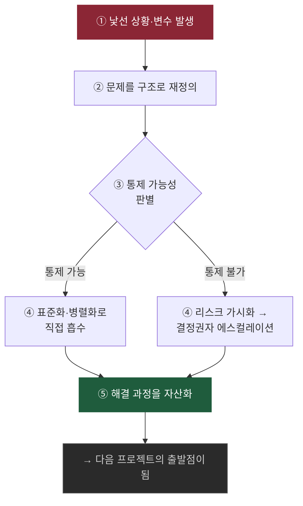
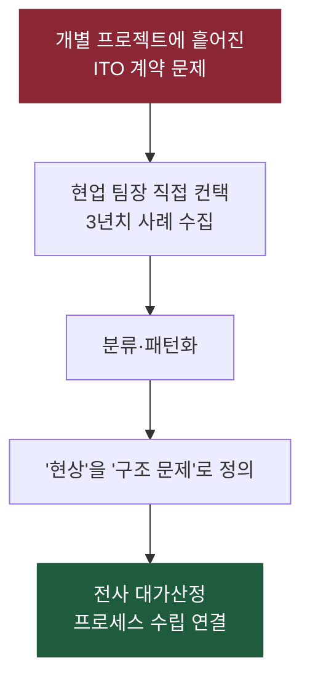
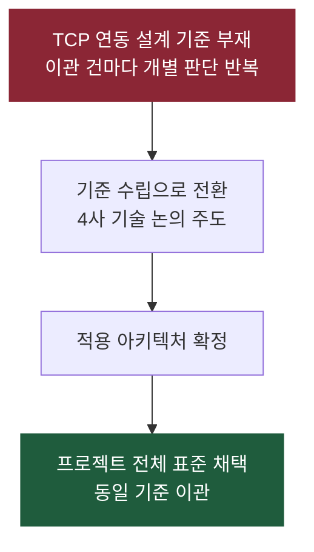
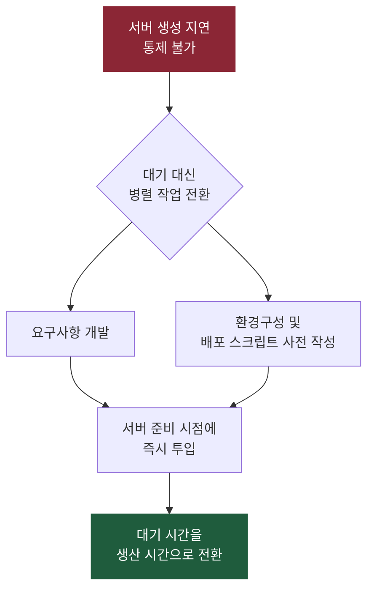
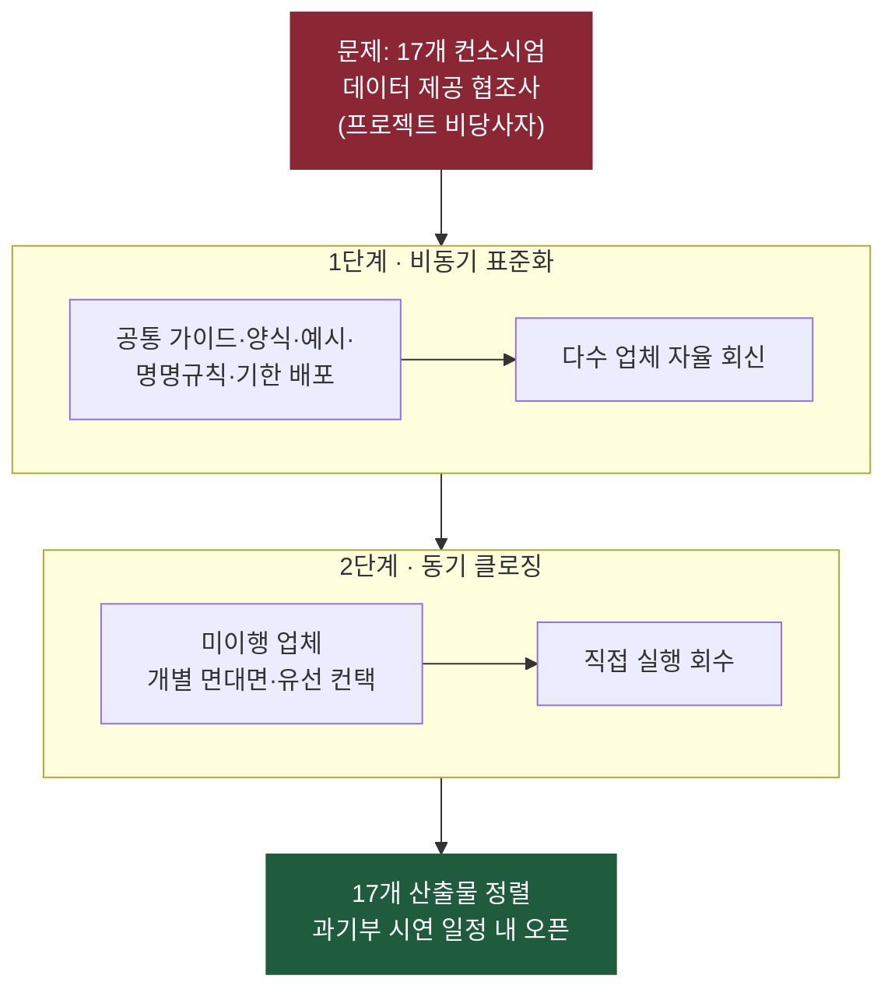
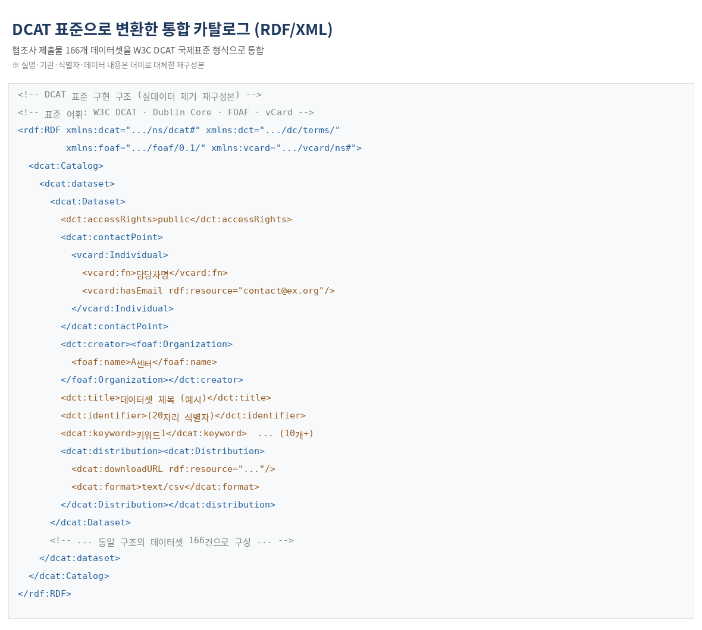

# 강미혜 포트폴리오

Project Manager / PL

kangmihye@gmail.com | [LinkedIn](https://www.linkedin.com/in/%EB%AF%B8%ED%98%9C-%EA%B0%95-1a29ba2b9/) | [인터뷰](https://m.blog.naver.com/ktds_official/222818903896)

> 권한 밖 영향력으로 조직을 정렬하고, 불확실성을 실행 구조로 흡수해온 PM

---

## 문제를 정의하는 방식

> 복잡한 문제일수록 해결보다 문제 정의가 더 중요하다
>
> — 제럴드 와인버그, 《대체 뭐가 문제야?》(Are Your Lights On?)

실행 압박이 우선되기 쉬운 환경에서도, 이 포트폴리오의 네 사례는 같은 지점에서 시작합니다. 문제를 먼저 정의하는 것입니다.

1. 문제를 구조로 재정의
2. 통제 가능 여부 판별
3. 표준화 또는 병렬화
4. 리스크 가시화
5. 실행 자산화

---

## 사례 1. 전사 ITO 사업구조혁신 TF — 문제 발견

**문제**

- ITO 계약 문제가 개별 프로젝트 이슈로 흩어져, 조직 차원의 '문제'로 정의되지 않은 상태

**결정**

- 최근 3년 신규 위탁 계약 문제 사례를 현업 팀장 개별 컨택으로 직접 수집하고, 분류·패턴화해 구조 문제로 전환

**결과**

- 현업 데이터 기반으로 정의된 문제가 전사 대가산정 프로세스 수립으로 연결

---

## 사례 2. Azure Mass Migration — 표준 수립

**문제**

- TCP 연동 아키텍처 설계 기준 부재로 이관 건마다 개별 판단이 반복되는 구조

**결정**

- 개별 대응 대신 기준 자체를 수립. AA·KT·KTC·Microsoft 기술 논의 주도

**결과**

- 확정 아키텍처가 프로젝트 전체 표준으로 채택되어, 동일 기준 이관으로 전담 6종 마일스톤 온타임 및 결함 0건

---

## 사례 3. Azure Mass Migration — 실행 구조 재설계

**문제**

- 서버 생성 일정 통제 불가

**결정**

- 대기 시간을 병렬 작업으로 전환

**결과**

- 외부 의존성을 일정 리스크가 아닌 실행 구조로 흡수. 일부 서비스는 서버 생성 후 3일 내 환경 구축 완료

---

## 사례 4. 통신 빅데이터 포털 — 권한 밖 영향력

**문제**

- 17개 컨소시엄 업체(프로젝트 비당사자)에 대한 지휘 권한 없음

**결정**

- 시연 일정 고정을 최우선 제약으로 두고, 산출물 정렬을 비동기 표준화 → 동기 클로징 2단계로 운영

**결과**

- 17개 컨소시엄 산출물 100% 회수. 메타데이터 140건 수집, 과기부 시연 일정 내 오픈

---

## 첨부 자료

### 메타데이터 작성 가이드

데이터 제공 컨소시엄 배포용 데이터셋 양식입니다. DCAT 메타데이터 표준을 협조사가 바로 작성할 수 있도록 번역·재구성한 것으로, 실제 협조사 데이터는 모두 더미로 대체했습니다.

| 필드명 | 필수/선택 | 작성 가이드 | 작성 예시(더미) |
| --- | --- | --- | --- |
| 순번 | 선택 | 입력 순번 | 1 |
| 접근권한 | 필수 | public / private 중 선택 | public |
| 연락처-이름 | 필수 | 담당자(개인) 정보 | 홍길동 |
| 연락처-전화 | 필수 | 담당자 전화번호 | 02-000-0000 |
| 연락처-이메일 | 필수 | 담당자 이메일 | contact@example.org |
| 생성자-기관명 | 필수 | 데이터 관리기관(센터/플랫폼) 정보 | A센터 |
| 생성자-전화 | 필수 | 기관 대표 전화번호 | 02-000-0000 |
| 생성자-이메일 | 필수 | 기관 대표 이메일 | info@example.org |
| 설명 | 필수 | 데이터셋 상세 설명. 최소 50자 이상 | ○○ 분야의 ... 데이터셋 |
| 제목 | 필수 | 요약 제목. 서술식 배제, 단어 3개 이상 구문 | ○○ 현황 데이터 |
| 생성일자 | 필수 | YYYY-MM-DD | 2019-11-07 |
| 수정일자 | 필수 | YYYY-MM-DD | 2019-11-07 |
| 사용언어 | 필수 | ISO 639-1 2자리 코드 (기본값 ko) | ko |
| 등록자-기관명 | 필수 | 데이터 등록기관(센터/플랫폼) 정보 | A센터 |
| 식별자 | 필수 | 플랫폼 내 unique 식별자 부여 (체계는 내부 규칙) | (20자리 코드) |
| 카테고리 | 필수 | 주제 분류 (복수는 , 로 구분) | Public,Life |
| 키워드 | 필수 | 의미기반 검색 핵심 항목. 최소 10개 이상 | 키워드1,키워드2,... (10개+) |
| 랜딩페이지 | 선택 | 데이터셋 접근 URL | https://example.org/... |
| 라이선스 | 필수 | 라이선스 문구 (자유양식) | CC BY |
| 공간/시간 해상도 | 선택 | 공간정보·시간정보 있을 경우 작성 | - |
| 배포주기 | 선택 | 배포 단위 (자유양식) | 1M |

### RDF 카탈로그

협조사 제출물 166개 데이터셋을 W3C DCAT 국제표준 형식(RDF/XML)으로 통합한 결과입니다. 실명·기관·식별자·데이터 내용은 더미로 대체한 재구성본입니다.

